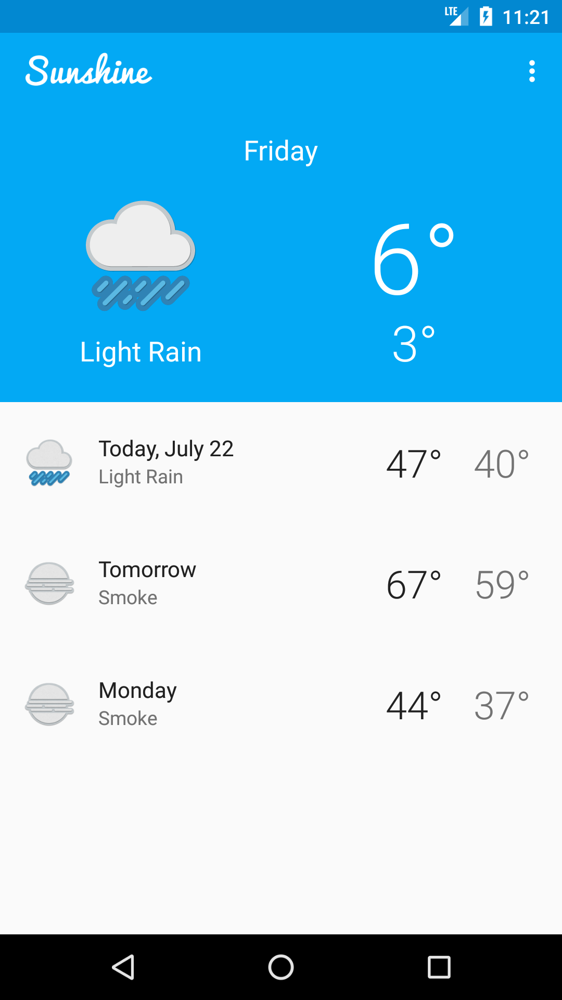
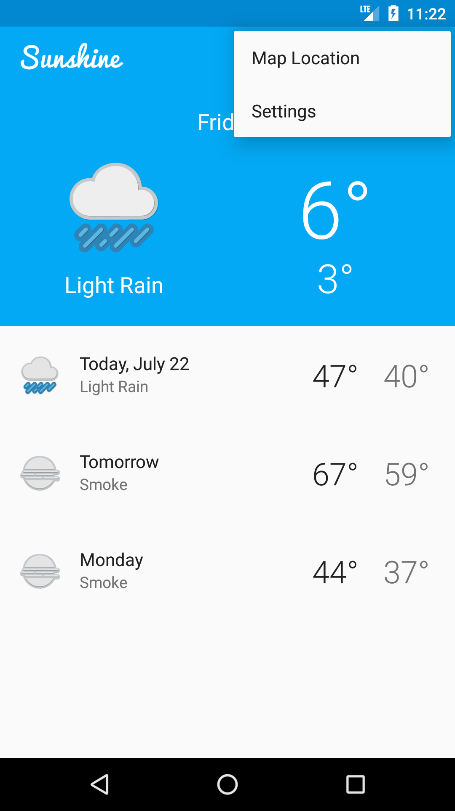
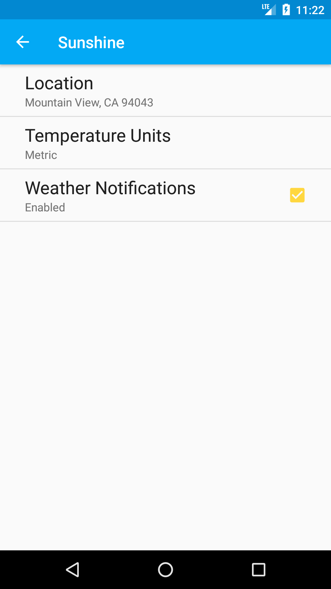
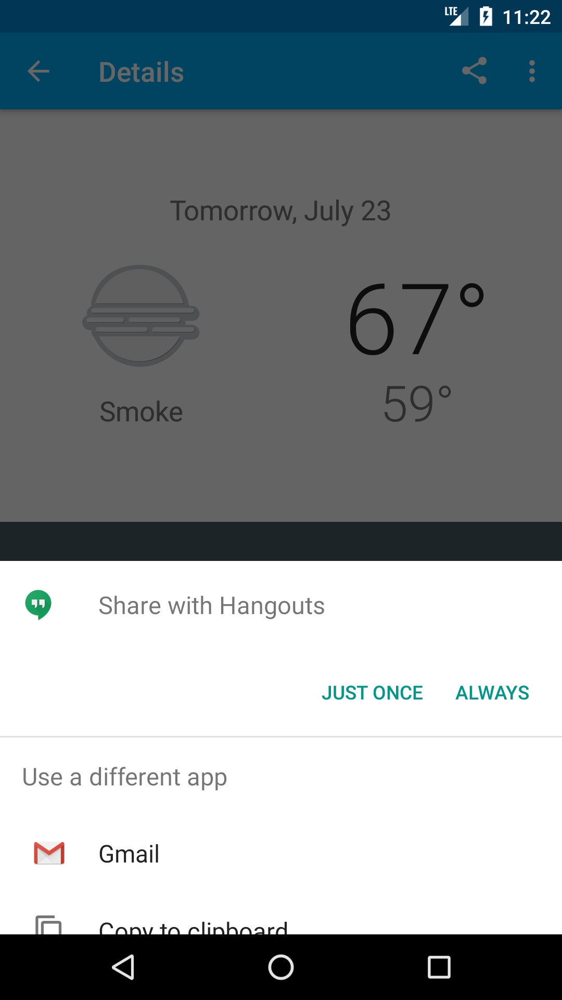
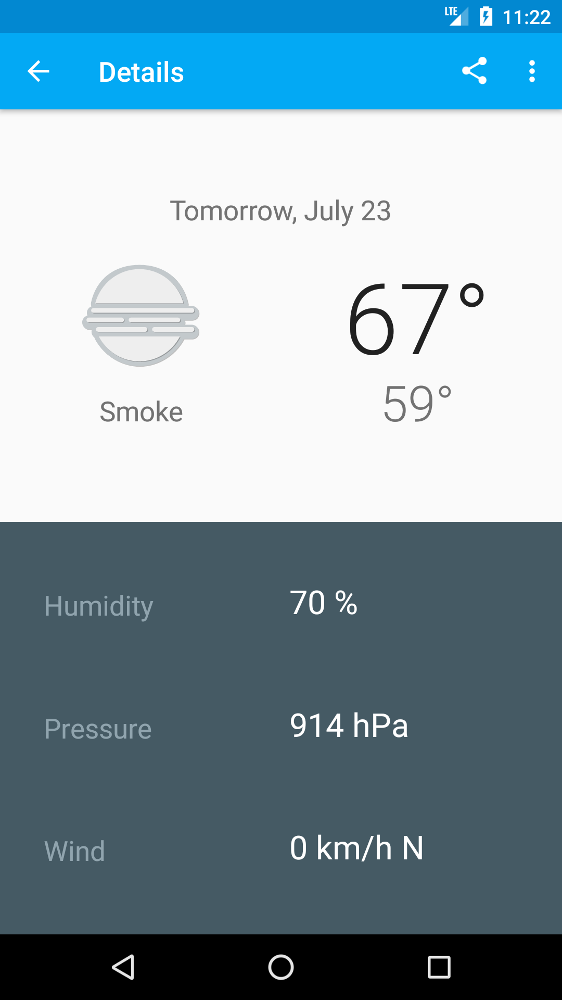

 1. Downloads weather data from
 internet and displays it using the help
 of content providers.
2. Schedules the weather notifications using Firebase
 jobDispatcher.
3. Can share weather data to other apps.
4. Can see the weather data as per the set preferences.

